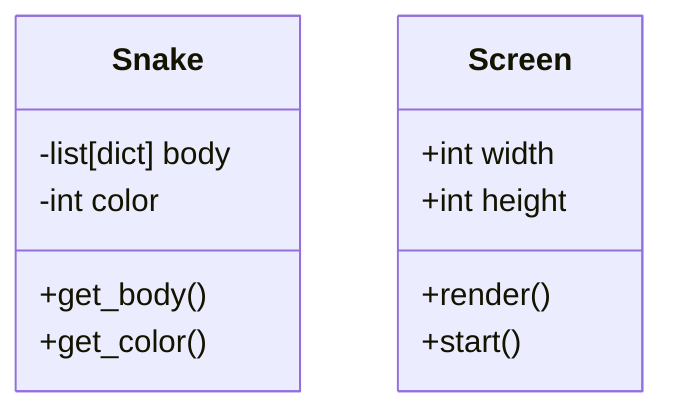

# App architecture

This is a learning app architecture for practicing requirement engineering and UML diagram creation.

## Requirements

1. The game should have a snake that moves around the screen.
2. The snake should be controlled by the arrow keys.
3. The snake should grow when it eats food.
4. The game should have a score board.
5. The game should detect when the snake collides with the wall.
6. The game should detect when the snake collides with itself.
7. The game should detect when the snake collides with food.
8. The game should have a game over screen.
9. The game should have a start screen.

## UML Diagram

